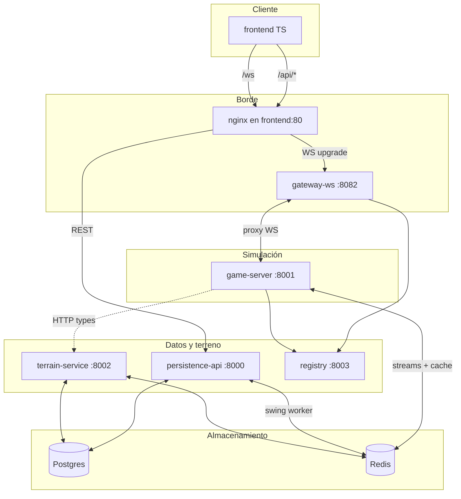
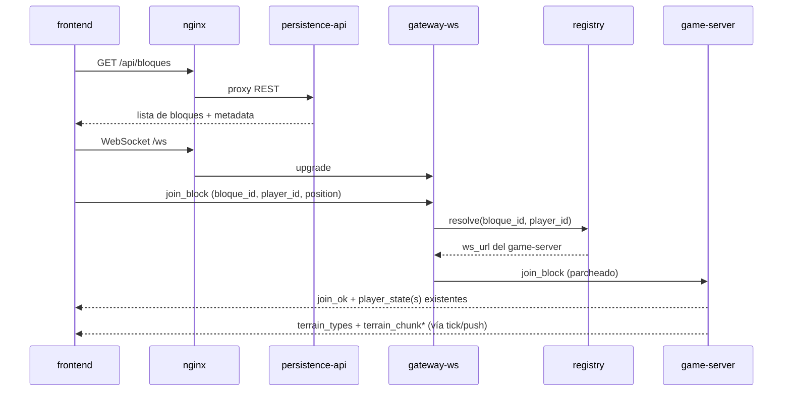
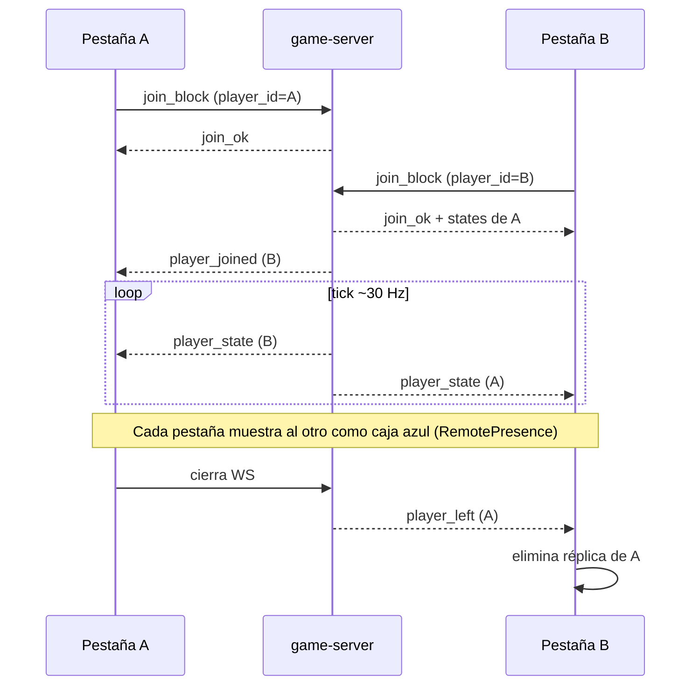
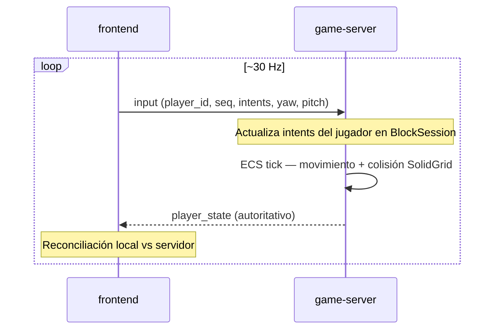
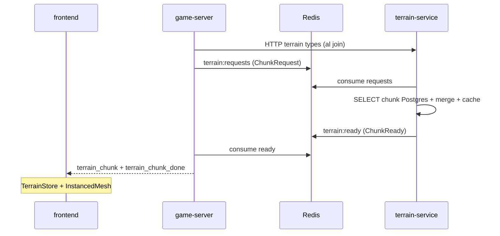
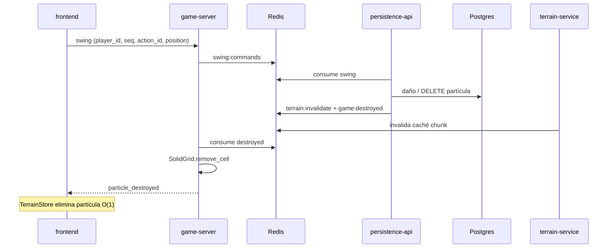

# JDD — Documentación general

Stack **Go + Rust + TypeScript** para el juego multijugador por bloques (partículas / voxels).

Esta carpeta es la **vista de alto nivel** para humanos: organización, servicios y flujos actuales.  
Para diseño detallado (contratos, roadmap, decisiones cerradas) ver [`instructions/ai/`](../instructions/ai/INDEX.md).

---

## Cómo levantar el stack

```powershell
cd jdd
docker compose up --build
```

| Qué | URL |
|-----|-----|
| **Juego (nginx + frontend)** | http://localhost:8080 |
| API REST | http://localhost:8080/api/bloques |
| WebSocket (vía nginx) | `ws://localhost:8080/ws` |
| Postgres | `localhost:5432` |
| Redis | `localhost:6379` |

Puertos directos (debug): game-server `:8001`, terrain `:8002`, registry `:8003`, gateway `:8082`, persistence `:8000`.

---

## Organización del monorepo

```text
jdd/
├── frontend/              # Cliente TS — Three.js, ECS, WebSocket, predicción
├── go/
│   ├── go.work            # Workspace Go (todos los módulos)
│   ├── pkg/jd/            # Librería compartida (auth, wire, rediskeys, worldgen…)
│   └── cmd/               # Un binario por servicio
│       ├── game-server/   # Simulación autoritativa + WS gameplay
│       ├── persistence-api/
│       ├── gateway-ws/
│       ├── registry/
│       └── seed/          # CLI worldgen (profile tools)
├── rust/terrain-service/  # Chunks, merge, caché Redis
├── shared/game-data/      # session.json, catálogo combate, schemas
├── database/init/         # Schema + seeds Postgres
├── scripts/               # Utilidades (ej. seed-lago.ps1)
├── instructions/ai/       # Docs técnicas para implementación
└── docs/                  # ← Estás aquí
```

**Regla:** cada servicio tiene su propio `go.mod` y carpeta `internal/` privada. El código compartido vive solo en `pkg/jd/` y `shared/`.

---

## Servicios y responsabilidades

| Servicio | Lenguaje | Puerto | Función |
|----------|----------|--------|---------|
| **frontend** | TypeScript | 8080 (nginx) | Render 3D, input, predicción local, réplicas de otros jugadores |
| **gateway-ws** | Go | 8082 | Proxy WebSocket cliente ↔ game-server; JWT (dev bypass); rate limit por IP |
| **game-server** | Go | 8001 | Sala por bloque+eco: tick ~30 Hz, movimiento, presencia, fanout terreno |
| **persistence-api** | Go | 8000 | REST (bloques, partículas); worker de swings; daño/destrucción en Postgres |
| **terrain-service** | Rust | 8002 | Lectura/merge de chunks desde DB, wire JSON/msgpack, caché Redis |
| **registry** | Go | 8003 | Matchmaking: asigna jugador → eco/shard y game-server (cupo por eco) |
| **seed** | Go | — | CLI para generar mapas (ej. `lago`); no corre en `docker compose up` normal |
| **postgres** | — | 5432 | Partículas, bloques, integridad |
| **redis** | — | 6379 | Streams async, caché de chunks, registry |

### Qué hace cada uno (en una frase)

- **frontend** — Muestra el mundo y habla con el backend por REST (carga inicial) y WS (tiempo real).
- **gateway-ws** — Puerta de entrada WS; el primer mensaje siempre es `join_block`; reenvía todo al game-server correcto.
- **game-server** — Autoridad de gameplay: posición de jugadores, colisiones con terreno sólido, eventos WS.
- **persistence-api** — Escribe en la DB lo que no puede ir en el tick (daño, deletes de partículas).
- **terrain-service** — Construye chunks bajo demanda; el game-server no mergea partículas masivamente.
- **registry** — Decide en qué eco/juego cae un `player_id` cuando hay varios game-servers (hoy: 1 instancia en dev).

---

## Topología (Docker)



---

## Flujo: arranque del cliente



El cliente genera un `player_id` estable **por pestaña** (`sessionStorage`) para multijugador y reconexión.

---

## Flujo: multijugador y presencia



Eventos WS de presencia:

| Evento | Cuándo |
|--------|--------|
| `player_joined` | Entra un jugador nuevo a la sala |
| `player_state` | Posición/velocidad/yaw cada tick |
| `player_left` | Se desconecta (cierra pestaña, etc.) |

---

## Flujo: input y movimiento



El movimiento usa `player_id`. La predicción y reconciliación viven en el cliente (`LocalPlayerReconciler`).

---

## Flujo: terreno (chunks)



Principio: el **game-server no lee Postgres para merge masivo** en el tick; delega en terrain-service.

---

## Flujo: ataque y destrucción



Deduplicación de swings por **`(player_id, seq)`** — no por `entity_id` ECS local.

---

## Redis — streams principales

| Stream | Productor | Consumidor | Propósito |
|--------|-----------|------------|-----------|
| `terrain:requests` | game-server | terrain-service | Pedir chunks |
| `terrain:ready` | terrain-service | game-server | Chunk listo para fanout |
| `terrain:invalidate` | persistence-api | terrain-service | Celda destruida → bump caché |
| `swing:commands` | game-server | persistence-api | Intención de ataque |
| `game:destroyed` | persistence-api | game-server | Fanout `particle_destroyed` WS |
| `game:swing_results` | persistence-api | game-server | Resultado opcional al atacante |

Claves de caché: `chunk:wire:*`, `chunk:solid:*`, `registry:*` — ver `go/pkg/jd/rediskeys`.

---

## Convenciones Go (servicios)

Todos los `cmd/*` siguen el mismo esquema:

```text
cmd/<servicio>/
├── main.go                 # Wiring + HTTP/WS + shutdown
└── internal/
    ├── config/             # Variables de entorno
    ├── delivery/           # HTTP o WS handlers (entrada)
    ├── usecase/            # Casos de uso / orquestación
    ├── domain/             # Entidades + ports (interfaces)
    └── infrastructure/     # Redis, Postgres, HTTP clients…
```

Excepción: **`seed`** es un CLI sin capas `internal/`; usa `pkg/jd/worldgen` directamente.

---

## Mapas disponibles

| Mapa | Cómo cargarlo |
|------|----------------|
| **Mundo Inicial** (default) | Seed SQL en `database/init/` al crear volumen Postgres |
| **Lago y Montaña** | `.\scripts\seed-lago.ps1` → jugar con `?bloque=lago` |

---

## Documentación relacionada

| Tema | Dónde |
|------|--------|
| Decisiones y roadmap | [`instructions/ai/07-implementation-roadmap.md`](../instructions/ai/07-implementation-roadmap.md) |
| Pipeline de destrucción | [`instructions/ai/10-destruction-pipeline.md`](../instructions/ai/10-destruction-pipeline.md) |
| Redis streams (detalle) | [`instructions/ai/04-redis-streams.md`](../instructions/ai/04-redis-streams.md) |
| Layout del monorepo | [`instructions/ai/11-monorepo-layout.md`](../instructions/ai/11-monorepo-layout.md) |
| Puertos y env | [`instructions/ai/infra/env-and-ports.md`](../instructions/ai/infra/env-and-ports.md) |
