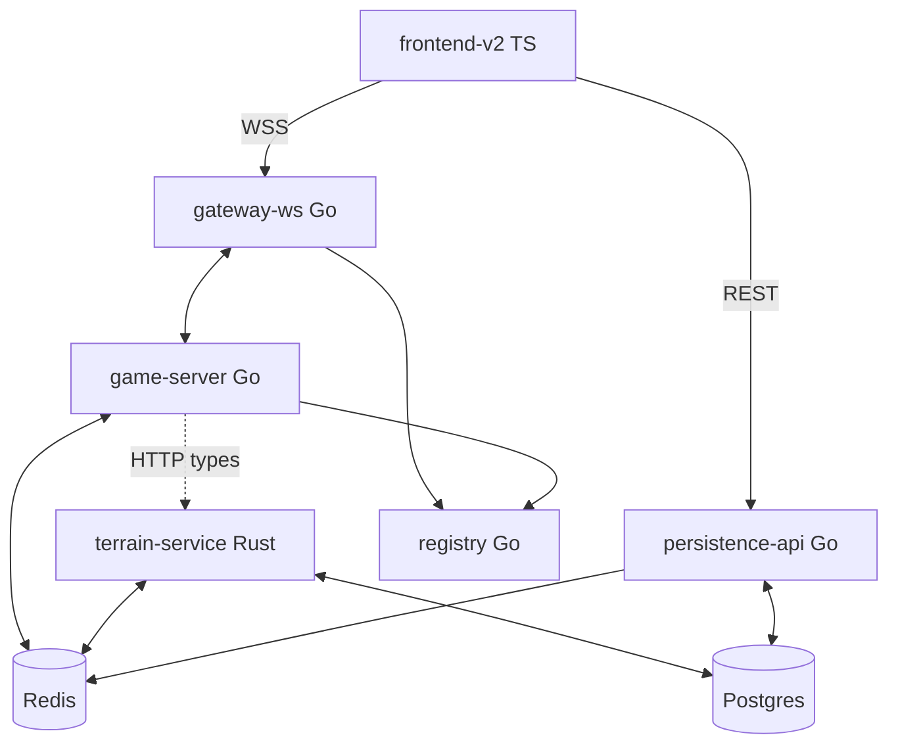

# Arquitectura — visión global

Backend **greenfield**: 5 servicios + Postgres + Redis + cliente TS.

**Usar cuando:** onboarding, dónde va una feature, flujos end-to-end, dudas de límites entre servicios.

**Organización de carpetas:** [11-monorepo-layout.md](./11-monorepo-layout.md)  
**Capas internas (Clean):** [12-clean-architecture.md](./12-clean-architecture.md)

---

## Monorepo

```text
juego-de-dioses/
├── shared/game-data/     session.json, schemas WS
├── shared/proto/         Protobuf inter-servicio
├── go/
│   ├── pkg/jd/           libs compartidas
│   └── cmd/              game-server, persistence-api, registry, gateway-ws
├── rust/terrain-service/
├── frontend-v2/
├── database/
- `instructions/ai/`               # Diseño para IA (use-index)
- Ver árbol completo: instructions/ai/11-monorepo-layout.md
```

---

## Servicios

| Servicio | Lang | Puerto | Rol |
|----------|------|--------|-----|
| **persistence-api** | Go | 8000 | REST, swing async, worldgen in-game |
| **game-server** | Go | 8001 | Sim 30 Hz, WS gameplay, SolidGridCache |
| **terrain-service** | Rust | 8002 | Chunks DB, merge, JSON wire, cache Redis |
| **registry** | Go | 8003 | Ecos, cupo 50, resolve/sync |
| **gateway-ws** | Go | 8082 | WSS proxy, JWT stub → completo |

**Infra:** Postgres (partículas), Redis (streams + cache).

---

## Topología



**Dev M1–M2:** cliente puede conectar directo a `game-server:8001/ws` sin gateway.

---

## Principios

1. **Tick sim sagrado** — game-server p99 &lt; 10 ms; sin DB ni merge terreno en hot path.
2. **Terreno aparte** — terrain-service Rust; game solo encola `ChunkRequest`.
3. **Destrucción async** — [10-destruction-pipeline.md](./10-destruction-pipeline.md).
4. **Bloque vs eco** — [02-ecos-dimensions.md](./02-ecos-dimensions.md).
5. **DB por bloque_id** — [03-database-postgres.md](./03-database-postgres.md).
6. **Wire browser JSON** — Protobuf solo inter-servicio.

---

## Flujo: join

```text
Cliente → join_block(bloque_id)
  → registry: eco con cupo (v1 directo a game en dev)
  → game-server: join_ok + player_state (inmediato)
  → game → terrain HTTP: terrain_types
  → game → Redis: ChunkRequest × ventana
  → terrain: DB + cache + ChunkReady
  → game: SolidGrid + fanout terrain_chunk* + terrain_chunk_done
```

---

## Flujo: tick (30 Hz)

```text
game-server loop:
  1. drenar input WS
  2. ECS tick (SolidGridCache)
  3. player_state WS
  4. schedule terrain requests (fire-and-forget)
  5. post-tick: drain ChunkReady → fanout terrain WS
```

---

## Flujo: destrucción

Ver [10-destruction-pipeline.md](./10-destruction-pipeline.md).

---

## Flujo: seed in-game

Ver [10-worldgen-seeds.md](./10-worldgen-seeds.md).

---

## Qué va en cada servicio (prohibiciones)

| Servicio | Sí | No |
|----------|----|-----|
| game-server | ECS, player_state, SolidGrid, fanout terrain | Postgres, merge partículas masivo |
| terrain-service | SELECT chunk, merge, wire JSON, cache | player_state, sim NPC |
| persistence-api | REST, swing worker, worldgen | WS gameplay, tick |
| registry | ecos, resolve, sync | sim, terreno |
| gateway-ws | proxy, JWT, rate limit | sim, DB |

---

## Referencia Python (legacy)

| Greenfield | Referencia |
|------------|------------|
| game-server | `backend/src/game/`, `ecs/` |
| terrain-service | `terrain_store.py`, `game/terrain/`, `terrain_ws_messages.py` |
| persistence-api | `backend/src/api/`, `database/`, `world_creation_engine/` |

---

## Docs relacionados

| Tema | Doc |
|------|-----|
| Ecos | [02-ecos-dimensions.md](./02-ecos-dimensions.md) |
| DB | [03-database-postgres.md](./03-database-postgres.md) |
| Redis | [04-redis-streams.md](./04-redis-streams.md) |
| Roadmap | [07-implementation-roadmap.md](./07-implementation-roadmap.md) |
| terrain-service | [services/terrain-service/01-overview.md](./services/terrain-service/01-overview.md) |
