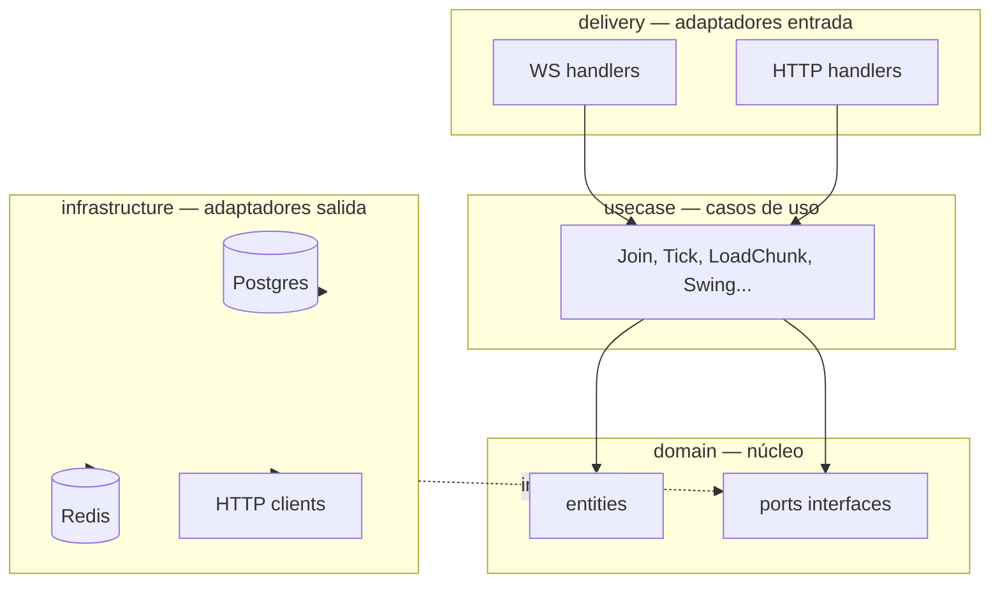

# Clean Architecture — propuesta

**Usar cuando:** crear paquetes internos, interfaces, use cases, dónde va la lógica vs handlers vs DB.

**Decisión HTTP:** **sin versionado en URLs** — no `/api/v1`, no `/internal/v1`, no `/v1/resolve`.  
Versionado de **contrato** solo en Protobuf (`package jd;`) y schemas JSON en `shared/` — no en paths.

---

## Regla de dependencia

```text
delivery (WS/HTTP)
    → usecase (application)
        → domain (entities + ports/interfaces)
            ↑ implementado por
    infrastructure (postgres, redis, clients)
```

- **domain** no importa `delivery` ni `infrastructure`.
- **usecase** solo conoce **ports** (interfaces), no sqlx ni gorilla/websocket concretos.
- **main.go** ensambla (wire/DI): inyecta repos concretos en use cases.



---

## Rutas HTTP (sin `/v1`)

| Servicio | Antes | Ahora |
|----------|-------|-------|
| persistence REST | `/api/v1/bloques` | `/api/bloques` |
| terrain internal | `/internal/v1/chunks/...` | `/internal/chunks/...` |
| registry | `/v1/resolve` | `/resolve` |
| registry | `/v1/sync-eco` | `/sync-eco` |
| health | `/health` | `/health` (igual) |

Frontend: `VITE_API_BASE=http://localhost:8000/api`

WebSocket gameplay: `ws://host/ws` (sin versión).

---

## Estructura Go (todos los `cmd/*`)

```text
go/cmd/<servicio>/
├── main.go                 # composición: config + DI + start
├── Dockerfile
└── internal/
    ├── domain/             # ENTITIES + PORTS (interfaces)
    ├── usecase/            # APPLICATION — orquesta domain + ports
    ├── delivery/           # INBOUND adapters
    │   ├── http/
    │   └── ws/             # solo game-server, gateway
    └── infrastructure/     # OUTBOUND adapters (implement ports)
        ├── postgres/
        ├── redis/
        └── httpclient/
```

### Qué va en cada capa

| Capa | Contiene | Ejemplo game-server |
|------|----------|---------------------|
| **domain** | Entidades, value objects, **ports** (interfaces) | `Player`, `BlockSession` rules, `TerrainPublisher` interface |
| **usecase** | Un caso de uso = una acción del sistema | `JoinBlock`, `RunTick`, `HandleInput`, `EnqueueSwing` |
| **delivery** | Parse JSON, status codes, WS routing | `dispatcher.go` → llama usecase |
| **infrastructure** | pgx, redis, clients | `RedisTerrainPublisher` implements port |

**ECS:** vive en `domain/sim/` o `internal/sim/` — el motor de sim es dominio; `usecase/tick.go` lo invoca.

---

## 1. game-server (Clean)

```text
internal/
├── domain/
│   ├── entity/
│   │   ├── player.go
│   │   └── block_session.go      # estado sala, reglas cupo local
│   ├── sim/                      # ECS (core + components + systems)
│   │   ├── world.go
│   │   └── systems/
│   │       ├── movement.go
│   │       └── contact.go
│   ├── collision/
│   │   └── solid_grid.go         # entidad/value — sólidos O(1)
│   └── port/
│       ├── terrain.go            # PublishChunk, SubscribeReady
│       ├── session_store.go      # GetBlockSession(bloqueID)
│       └── clock.go              # testable tick
│
├── usecase/
│   ├── join_block.go
│   ├── leave.go
│   ├── handle_input.go
│   ├── handle_swing.go           # encola, no DB
│   ├── run_tick.go               # 30 Hz — sim + player_state
│   └── terrain_fanout.go         # post-tick drain ChunkReady
│
├── delivery/
│   └── ws/
│       ├── server.go             # upgrader, lifecycle
│       ├── dispatcher.go         # switch message type
│       ├── messages.go           # DTO parse/build JSON WS
│       └── state_builder.go      # player_state JSON
│
└── infrastructure/
    ├── redis/
    │   ├── terrain_publisher.go
    │   └── terrain_subscriber.go
    ├── http/
    │   └── terrain_types.go      # GET /internal/types...
    └── ws/
        └── hub.go                # conexiones activas
```

**REF Python:** handlers → `delivery/ws`; `app.py` → `domain/entity/block_session`; ECS → `domain/sim`.

---

## 2. terrain-service (Clean — Rust)

```text
src/
├── domain/
│   ├── chunk_authority.rs        # entidad + reglas merge
│   ├── particle.rs               # value types
│   └── port/
│       ├── chunk_repository.rs   # trait fetch_chunk
│       ├── chunk_cache.rs        # trait get/put wire
│       └── event_bus.rs          # trait publish ready
│
├── application/                  # use cases
│   ├── load_chunk.rs
│   ├── get_wire.rs
│   ├── invalidate_cell.rs
│   ├── handle_block_seeded.rs
│   └── get_types_viewport.rs
│
├── adapters/
│   ├── inbound/
│   │   ├── http/                 # axum routes → application
│   │   └── redis/                # stream consumers
│   └── outbound/
│       ├── postgres/             # impl ChunkRepository
│       ├── redis/                # impl ChunkCache + streams
│       └── wire/                 # JSON terrain_* (mapper)
│
├── config.rs
└── main.rs                       # router + spawn + DI
```

**Workers:** la lógica pesada está en `application/load_chunk` llamada desde `spawn_blocking`; `adapters/inbound/redis` solo deserializa y delega.

---

## 3. persistence-api (Clean)

```text
internal/
├── domain/
│   ├── particle.go
│   ├── bloque.go
│   └── port/
│       ├── particle_repo.go
│       └── event_publisher.go
│
├── usecase/
│   ├── apply_swing.go
│   ├── apply_damage.go
│   ├── create_bloque.go          # worldgen trigger
│   └── list_bloques.go
│
├── delivery/
│   └── http/
│       ├── router.go             # /api/* montaje
│       ├── bloques/
│       ├── particles/
│       └── middleware/
│
├── infrastructure/
│   ├── postgres/
│   │   └── particle_repo.go
│   └── redis/
│       └── event_publisher.go
│
└── worldgen/                     # subdomain — mismo patrón
    ├── domain/
    ├── usecase/
    │   └── seed_bloque.go
    └── infrastructure/
        └── batch_inserter.go
```

Rutas: `/api/bloques`, `/api/particles`, `/api/characters`, …

---

## 4. registry (Clean)

```text
internal/
├── domain/
│   ├── eco.go
│   └── port/
│       └── eco_store.go          # trait SaveEco, Resolve...
│
├── usecase/
│   ├── register_game_server.go
│   ├── resolve_player.go
│   └── sync_eco.go
│
├── delivery/
│   └── http/
│       ├── resolve.go            # POST /resolve
│       ├── register.go           # POST /register
│       └── sync_eco.go           # POST /sync-eco
│
└── infrastructure/
    └── redis/
        └── eco_store.go
```

---

## 5. gateway-ws (Clean — delgado)

```text
internal/
├── domain/
│   └── port/
│       ├── registry.go           # Resolve upstream
│       └── token_validator.go
│
├── usecase/
│   └── proxy_session.go          # pipe WS
│
├── delivery/
│   └── ws/
│       └── gateway.go
│
└── infrastructure/
    ├── http/
    │   └── registry_client.go
    └── auth/
        └── jwt.go
```

---

## DTO vs domain

| Tipo | Dónde | Ejemplo |
|------|-------|---------|
| **DTO wire** | `delivery/*/messages.go` o `adapters/.../wire/` | JSON WS `join_block` |
| **Domain entity** | `domain/` | `BlockSession`, `ChunkAuthority` |
| **Proto** | Redis entre servicios | `ChunkRequest` bytes |

**Mapper:** delivery convierte DTO → input usecase; usecase no conoce tags JSON.

---

## main.go — solo wiring

```go
// pseudocódigo game-server
func main() {
    cfg := config.Load()
    redis := infrastructure.NewRedis(cfg.RedisURL)
    terrainPub := redis.NewTerrainPublisher(redis)
    hub := ws.NewHub()
    joinUC := usecase.NewJoinBlock(sessionStore, terrainPub, hub)
    handler := ws.NewDispatcher(joinUC, inputUC, ...)
    ws.Listen(cfg.Port, handler)
    go usecase.RunTickLoop(...)
}
```

Sin lógica de negocio en `main`.

---

## Tests por capa

| Capa | Test |
|------|------|
| domain | unit puro, sin mocks |
| usecase | mocks de ports |
| delivery | httptest / WS mock |
| infrastructure | integration testcontainers |

---

## Anti-patrones

| Evitar | Hacer |
|--------|-------|
| pgx en handler WS | usecase + repo |
| `/api/v1/...` | `/api/...` |
| `network/` + `game/` mezclados sin ports | clean layers |
| domain importa redis | port en domain, impl en infra |
| Lógica en `main.go` | usecase |

---

## Migración desde layout anterior (11)

| Antes (11) | Clean |
|------------|-------|
| `internal/network` | `delivery/ws` |
| `internal/game` | `domain/entity` + `usecase` |
| `internal/terrainclient` | `port` + `infrastructure/redis` |
| `internal/api` | `delivery/http` |
| `internal/database` | `infrastructure/postgres` |
| Rust `workers/` | `application/` + `adapters/inbound/redis` |

Ver también: [11-monorepo-layout.md](./11-monorepo-layout.md) (árbol repo; capas detalladas aquí).

---

## Protobuf

```protobuf
package jd;   // sin .v1 en URL; package proto estable
```

Breaking change futuro: nuevo message o campo `optional`, no `/v2` en HTTP.
